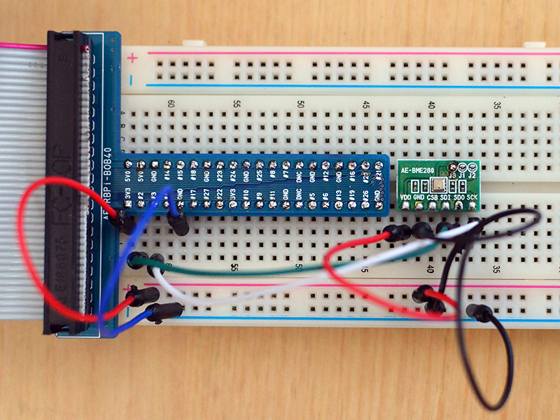

# Pi-BME280

## Background

This is a C driver program for operating a Bosch BME280 humidity, pressure and temperature sensor via I2C on a Raspberry Pi. I used it with an AE-BME280 module, and an unbranded module. On the AE-BME280, the J3 solder pad needs to be bridged for enabling I2C mode. If J1 and J2 are closed, it enables the optional onboard 4.7KOhm pull-up resistors. On a standard Pi, the I2C bus already has 1k8 pull-ups to 3V3. Other boards such as the Neo-Pi2 require explicit pull-ups.



## I2C bus connection


For I2C communication functions, I am using the i2c-tools and i2c-dev packages.

```
sudo apt-get install -y i2c-tools libi2c-dev
```
Now we can use the i2cdetect command to query the I2C bus. Connecting the AE-BME280 sensor to the Raspberry Pi I2C bus, the sensor responds with the slave address 0x76. Other modules may respond under the alternate I2C address 0x77.

```
root@pi-ws01:/home/pi# i2cdetect -y 1
     0  1  2  3  4  5  6  7  8  9  a  b  c  d  e  f
00:          -- -- -- -- -- -- -- -- -- -- -- -- --
10: -- -- -- -- -- -- -- -- -- -- -- -- -- -- -- --
20: -- -- -- -- -- -- -- -- -- -- -- -- -- -- -- --
30: -- -- -- -- -- -- -- -- -- -- -- -- -- -- -- --
40: -- -- -- -- -- -- -- -- -- -- -- -- -- -- -- --
50: -- -- -- -- -- -- -- -- -- -- -- -- -- -- -- --
60: -- -- -- -- -- -- -- -- -- -- -- -- -- -- -- --
70: -- -- -- -- -- -- 76 --
```

## Code compilation

Compiling the test program:
````
pi@rpi0w:~/pi-bme280 $ make
cc -O3 -Wall -g   -c -o i2c_bme280.o i2c_bme280.c
cc -O3 -Wall -g   -c -o getbme280.o getbme280.c
cc i2c_bme280.o getbme280.o -o getbme280 -lm
````

## Example output

Extracting the sensor version and configuration information with "-i":
```
pi@rpi0w:~/pi-bme280 $ ./getbme280 -a 0x77 -i
----------------------------------------------
BME280 Information at Sun Mar 15 21:05:45 2020
----------------------------------------------
    Sensor Chip ID = 0x60 BME280
     Humidity Mode = 8x
     Pressure Mode = OFF (skip)
  Temperature Mode = 16x
      Standby Time = 0.5ms
   IIR Filter Mode = 4
   3-wire SPI Mode = OFF
        Power Mode = NORMAL
 Temperature Coeff = T1: 28325 T2: 26508 T3:   50
    Pressure Coeff = P1: 37483 P2:-10626 P3: 3024
                     P4:  8942 P5:  -197 P6:   -7
                     P7:  9900 P8:-10230 P9: 4285
    Humidity Coeff = H1:    75 H2:   367 H3:    0
                     H4:   308 H5:    50 H6:   30
```

Enabling barometric pressure measurements with "-m p-1" in verbose mode:

```
pi@rpi0w:~/pi-bme280 $ ./getbme280 -a 0x77 -m p-1 -v
Debug: ts=[1584379410] date=Mon Mar 16 17:23:30 2020
Debug: I2C bus device: [/dev/i2c-1]
Debug: Sensor address: [0x77]
Debug: Got data @addr: [0x77]
Debug: Measuring type: [p]
Debug: Set osrs value: [1]
Debug: Write osrsmode: [0xC4] to register [0xF4]
```

Taking a single measurement, using the "-t" argument
```
pi@rpi0w:~/pi-bme280 $ ./getbme280 -a 0x77 -t
1584379440 Temp=23.23*C Humidity=36.04% Pressure=1005.91hPa
```

## Usage

Program usage:
```
Usage: getbme280 [-a hex i2c-addr] [-b i2c-bus] [-d] [-i] [-m osrs_mode] [-p pwrmode] [-t] [-c] [-r] [-o htmlfile] [-v]

Command line parameters have the following format:
   -a   sensor I2C bus address in hex, Example: -a 0x76 (default)
   -b   I2C bus to query, Example: -b /dev/i2c-1 (default)
   -d   dump the complete sensor register map content
   -f   set sensor IIR filter mode. arguments: <coefficient>. examples:
              off = disabled, 1 sample to reach >=75% of step response
                2 = 2 samples to reach >= 75% of step response
                4 = 5 samples to reach >= 75% of step response
          valid settings: off, 2, 4, 8, 16
   -i   print sensor information (config and calibration)
   -m   set sensor oversampling mode. arguments: <type>-<rate>. examples:
          t-skip  = disable the temperature measurement
             t-1  = temperature 1x oversampling
             h-2  = humidity 2x oversampling
             p-4  = pressure 4x oversampling
          valid types: t=temperature, h=humidity, p=pressure
          valid oversampling rates: skip, 1, 2, 4, 8, 16
   -p   set sensor power mode. arguments:
          normal  = cycle between measuring and standby
          forced  = take a single measurement and return to sleep
          sleep   = no measurements (default after power-up)
   -r   reset sensor
   -t   read and output single measurement (power mode forced)
   -c   read and output continuous measurements (power mode normal, 1sec interval)
   -o   output data to HTML table file (requires -t/-c), example: -o ./bme280.html
   -h   display this message
   -v   enable debug output


Usage examples:
./getbme280 -a 0x77 -b /dev/i2c-0 -i
./getbme280 -t -v
./getbme280 -c
./getbme280 -t -o ./bme280.html

```

The sensor register data can be dumped out with the "-d" argument:
```
pi@rpi0w:~/pi-bme280 $ ./getbme280 -a 0x77 -d
------------------------------------------------------
BME280 register dump:
------------------------------------------------------
 reg    0  1  2  3  4  5  6  7  8  9  A  B  C  D  E  F
------------------------------------------------------
[0x80]                         A5 6E 8C 67 32 00 6B 92
[0x90] 7E D6 D0 0B EE 22 3B FF F9 FF AC 26 0A D8 BD 10
[0xA0] 00 4B
[0xD0] 60
[0xE0] 00 6F 01 00 13 24 03 1E 37 41 FF FF FF FF FF FF
[0xF0] FF 00 04 0C C3 08 00 80 00 00 7F FE F0 63 DF
```
